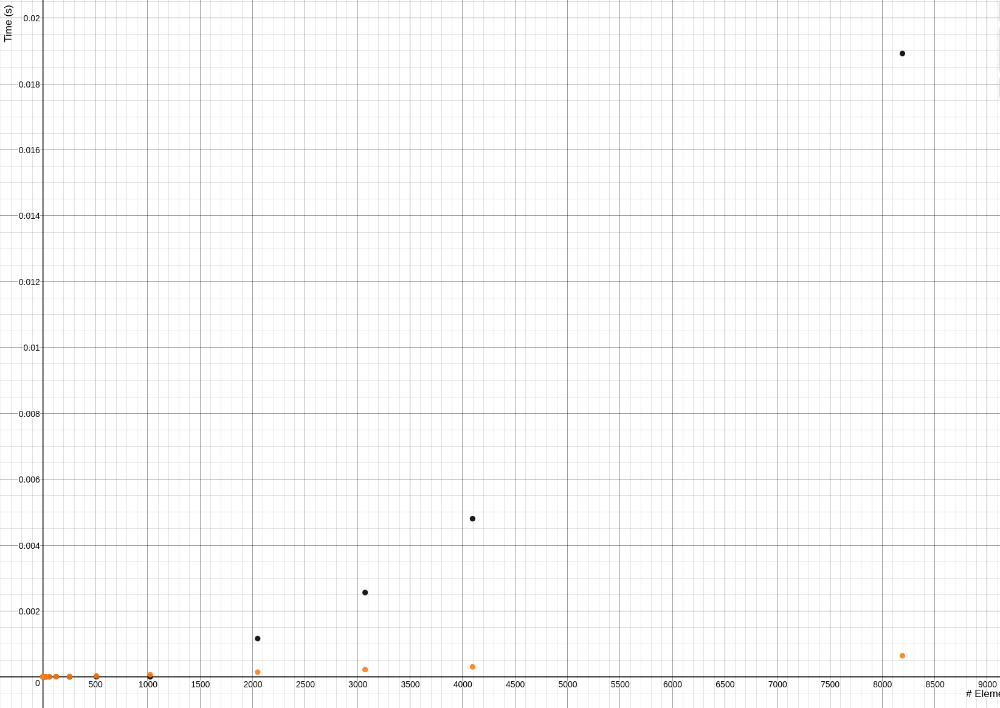
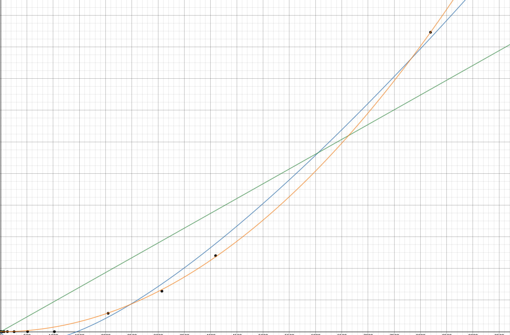
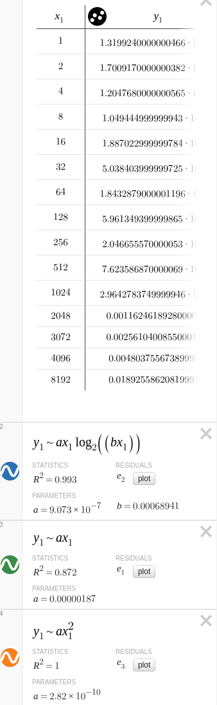
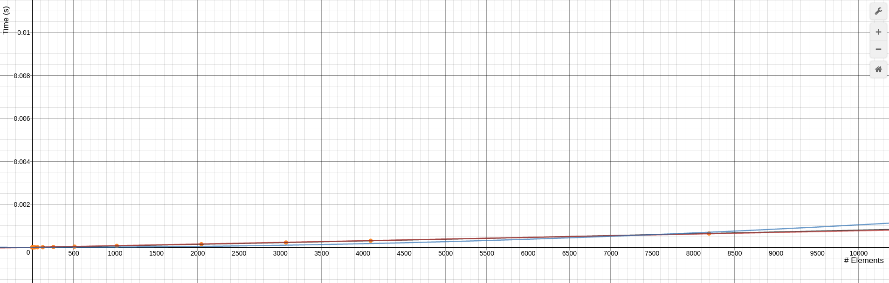
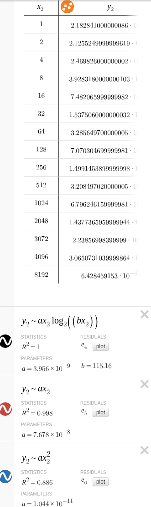

# GIJoe

##How To Run:
First, clone the repository using `git clone git@github.com:Gillgamesh/GIJoe.git`. Then, you can run the program for yourself to simply `javac QuickSortTester.java && java QuickSort`.
Note: Because of the sheer amount of recursive calls that may occur in a worst case performance scenario, it is recommended that you instead run `javac QuickSortTester.java && java -Xss512M QuickSort`, letting java know to increase the size of a stack, and allowing it to make more function calls without thinking it is in an infinite loop.

##Runtime
The worst case runtime is O(n^2), while the best case is O(nlogn), with the average falling somewhere in between. This is all dependent on the pivot position, which is discussed lower down. Each partition call has a linear runtime, so your overall runtime is effectively determined by the amount of partition calls you need to perform. In certain cases, such as the ascending/first element case, or the all equal case, this will mean calling the partition method n times, while in optimal cases it will be called in logn times.
##Method
The time measured tests were run on a desktop 3770k at stock speeds, running Ubuntu 16.04 and OpenJDK 1.8.0_91.
The arrays are randomly generated with lengths of large powers of 2. We run each time 10,000 times for the smaller arrays and up to 10 times for the larger arrays. Then we averaged the times to assess the runtimes for the average or most likely case.
This was then graphed, using [desmos](https://www.desmos.com/calculator), and the built in regression algorithims were used to approximate functions that fit the given data points.

##Pivot Selection
For our pivot point, we chose the midpoint between the left and rightmost points of a partition. We found that it was a good compromise between calculation speed and dealing with the majority of worst-cases such as an already sorted array, a partially sorted array, or an array assorted in a descending manner. While choosing either the left and rightmost points as a pivot would have resulted in both the ascending and descending case generating an O(n^2) runtime, for midpoints it is only a V shaped array that generates this, where the middle element of a partition is either the minimum or the maximum, a very rare edge case.
There were two alternatives considered. One consisted of choosing 3 random numbers, and taking the median of those to get a number close to the median theoritically, while the other involved just taking a single random number. However, we found that atleast in our real runtimes, these performed worse on average because of the runtime of the Math.random() function call.
##Data Arrangement
The worst performing data arrangements are those where your pivot point ends up being placed close to the beginning or the end of an array, creating one really small partition and one really big one. While hopefully these average out, for our pivot selection the worst performance would be an array that has it's partitions sorted in a V, such as `{1,2,1,3,1,2,1}`, where the pivot would be pushed to the front. The best part about choosing the midpoint however, is that near sorted arrays will only be partioned about logn times, as the midpoints index will always be about the same before and after a partition in those cases.

##Time Measurements

###Observations and Key Notes

Sadly, likely due to the performance of up to n recursive calls, extremely large numbers took much longer than expected, meaning that not enough large data points were collected for a proper graph, and the highest length sorted in a reasonable amount of time was only 68 million. However, a trend can still be noticed that shows a runtime that most closely matches O(n^2) for the larger numbers, and O(nlogn) for medium sized arrays. The O(n^2) might have just been caused by the small number of trials that could be run to finish in a reasonable amount of time.

###Worst Case vs. Average Case
This scatterplot shows that while the worst case lines up nearly perfectly with a quadratic regression, the average case appears to be near linear as logn grows ever smaller.

####Worst Case:

In this case, our worst case performance example was generated in the cleanest way possible -- an array of all 0s. This guarantees worst case performance when you select the midpoint, because the pivot point is always the greatest number, meaning all other 0s will be on another side of it no matter what pivot point you pick. This emulates the cases for ascending/descending mentioned earlier.  

| Length | Time (s)              |
|--------|-----------------------|
| 1      | 1.2244569999999342E-7 |
| 2      | 1.2957339999999244E-7 |
| 4      | 1.363292000000013E-7  |
| 8      | 1.1832539999999696E-7 |
| 16     | 1.8833679999999282E-7 |
| 32     | 4.913504000000119E-7  |
| 64     | 1.956601599999951E-6  |
| 128    | 6.219524200000099E-6  |
| 256    | 2.0666469600001048E-5 |
| 512    | 7.557320529999887E-5  |
| 1024   | 2.883885424999993E-4  |
| 2048   | 0.0011360456137999972 |
| 3072   | 0.0025454741111999965 |
| 4096   | 0.0045753745976999894 |
| 8192   | 0.018307890423199982  |

Color reference/Regression Equations are as follows:

####Average Case:
The average case, on the other hand, was generated simply by making every element in an array equal to a random integer. Over 10,000 runs, the best cases and worst cases tend to cancel out, and generate something that most closely represents O(nlogn). This can be seen by how closely the regression matches the scatter points, and also can be properly calculated by calculating the standard deviations.

| Length | Time (s)              |
|--------|-----------------------|
| 1      | 2.182841000000086E-7  |
| 2      | 2.1255249999999619E-7 |
| 4      | 2.469826000000002E-7  |
| 8      | 3.9283180000000103E-7 |
| 16     | 7.482065999999982E-7  |
| 32     | 1.5375060000000032E-6 |
| 64     | 3.285649700000005E-6  |
| 128    | 7.070304699999981E-6  |
| 256    | 1.4991453899999998E-5 |
| 512    | 3.208497020000005E-5  |
| 1024   | 6.796246159999981E-5  |
| 2048   | 1.4377365959999944E-4 |
| 3072   | 2.23856998399999E-4   |
| 4096   | 3.0650731039999864E-4 |
| 8192   | 6.428459153E-4        |

Color reference/Regression Equations are as follows:

This same testing methodlogy was also used for much larger arrays, but surprisingly produced runtimes that had a greater variance in trend. While between 2^25 to 2^26 there is a quadruple increase in time, suggesting O(n^2), other points suggest O(nlogn). This is likely due to the small amount of test cases.Sadly, because of how long they take to generate, it was not practicle to graph them.

| Length    | Time (s)       |
|-----------|----------------|
| 32768     | 0.0029760478   |
| 1048576   | 0.1522717055   |
| 33554432  | 57.8165631186  |
| 67108864  | 224.8127895529 |
| 134217728 | 896.5510855342 |
